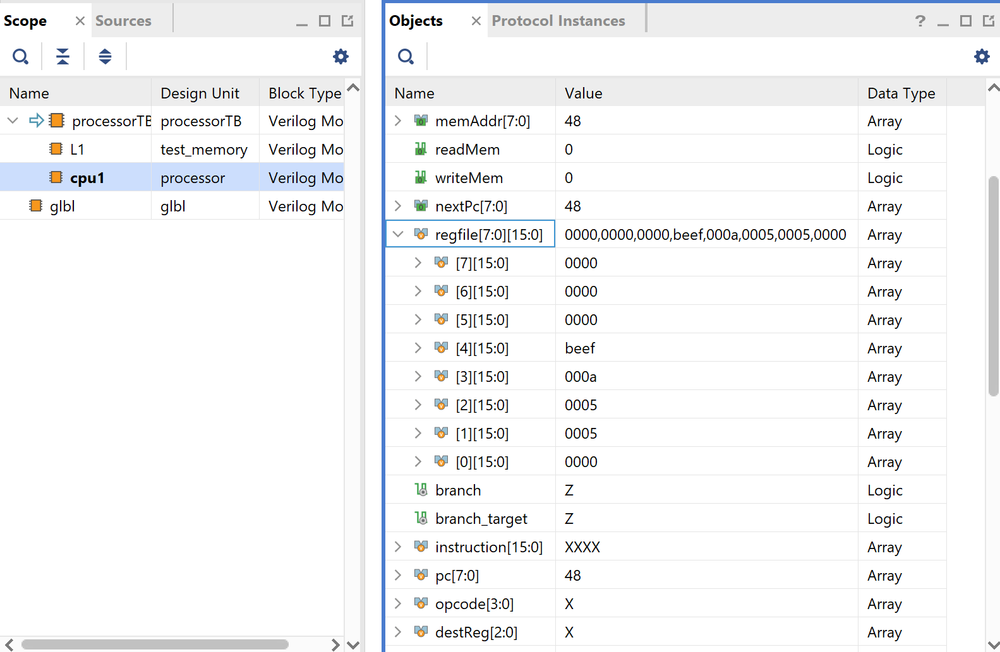
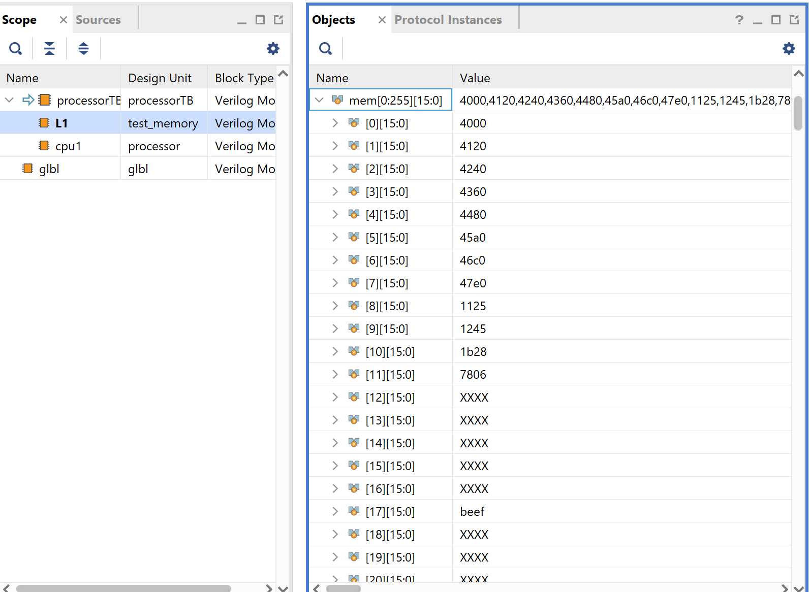

Sample run:
AND R0, R0, #0; \n
AND R1, R1, #0; \n
AND R2, R2, #0; \n
AND R3, R3, #0; \n
AND R4, R4, #0; \n
AND R5, R5, #0; \n
AND R6, R6, #0; \n
AND R7, R7, #0; //Initialize registers \n
ADD R1, R1, #5; //put 5 into register 1 \n
ADD R2, R2, #5; //put 5 into register 2 \n
ADD R3, R1, R2; //Add 5 + 5 into R3 \n
ST R4, #8; //Store the contents of 0x11 into register 4 \n

Copy and paste the below code into the preload section of the testbench.
Because it is 13 commands. The additional run time should be 13 * 70 = #910 \n

To check the output, you can either view the memory or the register content of the processor.
To look at register content of the processor, go to scope, click on cpu1, and look in the objects tab and scroll to regfile

To look at memory, go to scope, click on L1, and look at the objects tab and open up mem.

//regInit

// AND R0, R0, #0
preload_addr = 8'h00;
preload_data = 16'b0100000000000000; // AND R0, R0, #0
#10;

// AND R1, R1, #0
preload_addr = 8'h01;
preload_data = 16'b0100000100100000; // AND R1, R1, #0
#10;

// AND R2, R2, #0
preload_addr = 8'h02;
preload_data = 16'b0100001001000000; // AND R2, R2, #0
#10;

// AND R3, R3, #0
preload_addr = 8'h03;
preload_data = 16'b0100001101100000; // AND R3, R3, #0
#10;

// AND R4, R4, #0
preload_addr = 8'h04;
preload_data = 16'b0100010010000000; // AND R4, R4, #0
#10;

// AND R5, R5, #0
preload_addr = 8'h05;
preload_data = 16'b0100010110100000; // AND R5, R5, #0
#10;

// AND R6, R6, #0
preload_addr = 8'h06;
preload_data = 16'b0100011011000000; // AND R6, R6, #0
#10;

// AND R7, R7, #0
preload_addr = 8'h07;
preload_data = 16'b0100011111100000; // AND R7, R7, #0
#10;

//ADD R1, R1, #5

preload_addr = 8'h08;
preload_data = 16'b0001000100100101; // ADD R1, R1, #5
#10;

//ADD R2, R2, #5

preload_addr = 8'h09;
preload_data = 16'b0001001001000101; // ADD R2, R2, #5
#10;

//ADD R3, R1, R2

preload_addr = 8'h0A;
preload_data = 16'b0001101100101000; // ADD R3, R1, R2
#10;

//ST R3, #8

preload_addr = 8'h0B;
preload_data = 16'b0110100000000110; // ST R3, #8
#10;

preload_addr = 8'h11;
preload_data = 16'b1011111011101111 //BEEF
#10;
